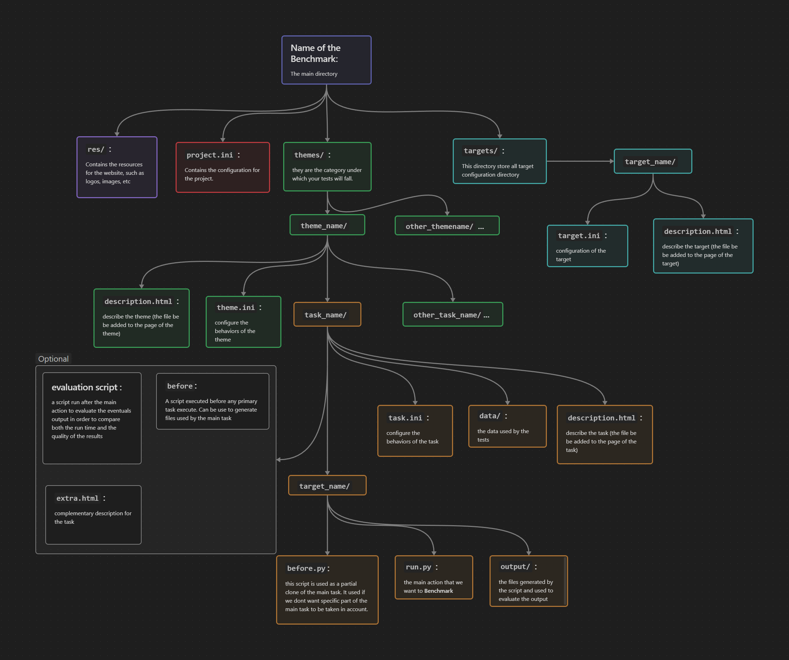

# BenchSite
A BenchMark project to compare differents library

## Seting the python Environment 

you'll need to add the library that will be compare. If not, the test won't run and the only result will be error 
inside the main file, create a virtual environment for python and run the following command to install the 
dependency required within *requirement.txt*.

`python -m venv venv`

`venv/Script/activate.bat`

`pip install -r requirement.txt`

If you don't want to use the venv, the only library required to run the project are:
- psutil
- numpy
- Pygments
- Jinja2
- tqdm 

and completed by the library you want to benchmark.

# GeneratedVelocity
  
## What is GeneratedVelocity ▶️
            
GeneratedVelocity is a platform designed to <b>compare the performance of different libraries and frameworks</b>. It
provides a detailed report of each library's speed, precision, and other parameters, making it easier for
developers to choose the best library for their project.

## GeneratedVelocity Brief explained 📰
           
GeneratedVelocity is designed to automate the process of comparing and testing different libraries. To
achieve this, the test are written in configuration files, then given to GeneratedVelocity. The tests are executed in a
controlled environment, and the results are then analyzed and compiled into easy-to-read reports. These reports
are output as HTML files structured and then published on dedicated GitHub pages, where users can access them and see how the different libraries perform
in a variety of scenarios. By automating the testing process, the website enables developers to save time and
effort when evaluating libraries, and helps them make informed decisions.

## First steps 👣
           
First of all, you'll need to get the project on your computer. To do so, you can either download the project
directly from GitHub, or clone it using the following command:

               
<code>
    git clone https://github.com/White-On/BenchSite
</code>
  
Once you have the project on your computer, you can start creating your own benchmark. To do so, you'll need to
create a new directory with a specific structure. The directory should contain 3 subdirectories: <b>targets</b>,
<b>themes</b>, and <b>site</b>. The <b>targets</b> directory contains the configuration files for the libraries
you want to test. The <b>themes</b> directory contains the configuration files for the tests you want to run. The
<b>site</b> directory contains the configuration files for the website. 

    
For more information on the structure of the directory

    

## Setup and Launch 🚀
Once you've installed the project and create your benchmark, we're going to need to install all the required
libraries. We recommend to use a virtual environment.

    
Create a virtual environment 📦

      - On Windows
      Create a virtual environment using the following command:
      <code>
          python -m venv [name of your virtual environment]
      </code>
      Activate your virtual environment using the following command:
      <code>
          [name of your virtual environment]\Scripts\activate.bat
      </code>
      Deactivate your virtual environment using the following command:
      <code>
          [name of your virtual environment]\Scripts\deactivate.bat
      </code>
      
      - On Linux

      
      Create a virtual environment using the following command:
      <code>
          python3 -m venv [name of your virtual environment]
      </code>
      Activate your virtual environment using the following command:
      <code>
          source [name of your virtual environment]/bin/activate
      </code>
      Deactivate your virtual environment using the following command:
      <code>
          deactivate
      </code>
      <a href="https://docs.python.org/3/library/venv.html">More informations</a>

    To ease your install, there is a <b>Makefile</b>. To see available commands run:
    
    <code>
        make help
    </code>
    
    To install all the required libraries, run:
    
    <code>
        make install
    </code>
    
    You're now ready to launch your benchmark. Depending on where your benchmark is located, either locally or
    online, on a github repository, or if you want to publish the results on a github page, you'll need to run a
    different command. To see available commands run:
    
    <code>
        python main.py --help
    </code>
    

            
        

    

    

        

            <h2>How we compare the targets 🤔</h2>
            

                For the time being, we decided to compare results base on the <b>Lexicographic Maximal Ordering Algorithm (LexMax)</b>.
                Each ranking is based on the number of wins, ties, and losses of each library. The target with the highest
                number of wins is ranked first, followed by the library with the second-highest number of wins, and so on. In
                the case of a tie, both libraries are ranked equally. The algorithm does not take into account the magnitude of the wins or losses, only the number of them.  
            

        

    

    

        

                We use it to compare all the data generated by the benchmarking process. For example, we run a task on a set of
                libraries, and we get the results. Each result is compared to the other result with the same argument, and we get a
                score for each argument. On the entire task, we get a vector of score for each library. We use the LexMax
                algorithm to compare the vector of score for each library and we get a ranking of the libraries for that task.
                We do this for each task and repeat it for the theme and the global ranking.
            

        

        

            <video controls autoplay muted loop width="100%">
                <source src="about_page/explanation.mp4" type="video/mp4">
                
Your browser does not support the video tag.

            </video>
        

    

    

        

            <h2>How to contribute ✍️</h2>
            
The benchmark website is an open-source project, and contributions from the community are welcome. To contribute,
                users can fork the project on GitHub, make changes to the code, and submit a pull request. Users can also
                contribute by reporting bugs, suggesting improvements, or sharing their benchmarking results.
                  
                <a href="https://github.com/White-On/BenchSite">GitHub repository</a>
            

        

    

